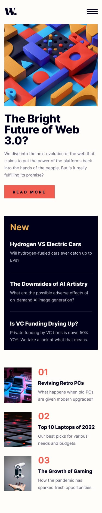

# Frontend Mentor - News homepage solution

This is a solution to the [News homepage challenge on Frontend Mentor](https://www.frontendmentor.io/challenges/news-homepage-H6SWTa1MFl).

## Table of contents

- [Overview](#overview)
  - [Screenshot](#screenshot)
  - [Links](#links)
- [My process](#my-process)
  - [Built with](#built-with)
  - [What I learned](#what-i-learned)
  - [Continued development](#continued-development)
- [Author](#author)

---

## Overview

### Screenshot

|  |  |
| :--: | :--: |
| Desktop | Mobile |

### Links

- Solution URL: [Frontend Mentor](https://github.com/rahulpaul127/news-homepage)
- Live Site URL: [GitHub Pages](https://rahulpaul127.github.io/news-homepage/)

---

## My process

### Built with

- Semantic HTML5 markup
- CSS custom properties
- CSS Flexbox & CSS Grid
- Mobile-first responsive workflow
- Vanilla JavaScript for mobile menu interaction
- `<picture>` element for responsive images

### What I learned

- **CSS Grid for Page Layout**: Used a two-column CSS Grid (`grid-template-columns: 2fr 1fr`) to build the desktop layout, with nested grids inside the featured article to position the hero image, title, and description in the correct positions matching the design.
- **Responsive Images with `<picture>`**: Used the `<picture>` element with a `<source media="...">` attribute to swap between the mobile and desktop hero images at the correct breakpoint, ensuring the right image is always served without any JavaScript.
- **Off-Canvas Mobile Navigation**: Built a slide-in drawer navigation for mobile using CSS `position: fixed` and `right: -100%`, toggling it to `right: 0` via a JavaScript class. A semi-transparent overlay behind the drawer prevents interaction with the page content.
- **Scroll Lock**: Applied `overflow: hidden` to the `<body>` via a `.no-scroll` class whenever the mobile menu is open, preventing the user from scrolling the background content while the drawer is active.
- **CSS Custom Properties for Theming**: Defined all colors from the style guide as CSS variables in `:root`, making the entire color system centralized and easy to maintain.

### Continued development

- Add the final deployed links after publishing the project.
- Implement keyboard navigation and focus trapping inside the mobile menu for better accessibility (`aria-expanded`, `aria-controls`).
- Add a smooth entrance animation for article cards on page load using the Intersection Observer API.

## Author

- Frontend Mentor - [@rahulpaul12](https://www.frontendmentor.io/profile/rahulpaul12)
- Twitter - [@rahulpaul127](https://x.com/rahulpaul127)
